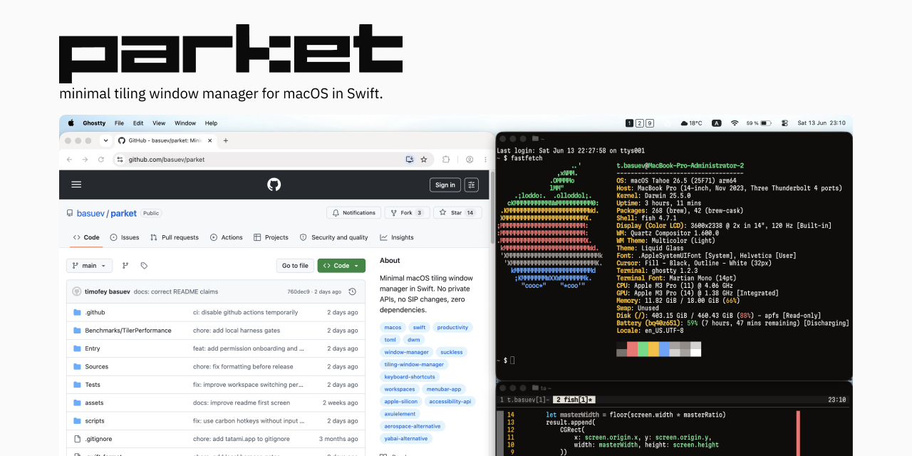

# parket

minimal tiling window manager for macOS.

parket uses swift and public macOS APIs. no private API, no SIP modifications, zero dependencies.

it emulates workspaces by moving windows offscreen and tiles windows with a dwm-style master-stack layout.

parket switches workspaces faster than AeroSpace in the count-gated UX latency harness. on the latest two-display run, parket reduced default focus p95 from 29.7 ms to 9.5 ms and multi-monitor focus p95 from 38.9 ms to 15.2 ms.



inspired by [dwm](https://dwm.suckless.org/) and [AeroSpace](https://github.com/nikitabobko/AeroSpace).

## install

```fish
brew install --cask basuev/parket/parket
```

or build from source:

```fish
make install
open /Applications/parket.app
```

parket opens a permission window on first launch. grant Accessibility, then use Recheck from the window or Recheck Accessibility from the menubar.

the GitHub release zip is ad-hoc signed for now. Homebrew is the recommended install path.

## requirements

- macOS 14+, Apple Silicon
- accessibility permission

## features

- **workspaces** - 9 virtual workspaces via offscreen window hiding
- **master-stack tiling** - new windows auto-tile in dwm-style layout
- **monocle layout** - per-workspace fullscreen mode, toggle with option+m
- **menubar indicator** - badge widgets show active workspace and occupied ones
- **custom keybindings** - bind supported key names to shell commands via toml config
- **multi-monitor** - per-display workspaces, each monitor has its own workspace set
- **app switcher follow** - command+tab to a hidden workspace window opens that workspace
- **exit safety** - tracked windows restore on quit, SIGTERM, and SIGINT
- **permission onboarding** - menubar and permission window show Accessibility state
- **escape hatches** - pause tiling, retile now, restore all windows, open config, copy diagnostics

## keybindings

macOS command+tab stays the system app switcher. when it selects a window on another parket workspace, parket opens that workspace and focuses the selected window.

| key | action |
|-----|--------|
| `Option + 1-9` | switch workspace |
| `Option + Shift + 1-9` | move focused window to workspace |
| `Option + J/K` | focus next/prev window |
| `Option + Return` | swap focused window with master |
| `Option + Tab` | switch to last active workspace |
| `Option + M` | toggle monocle layout |
| `Option + ,` / `Option + .` | focus prev/next monitor |
| `Option + Shift + ,` / `Option + Shift + .` | move window to prev/next monitor |

most action bindings are configurable - see configuration below. workspace switch and move bindings stay on 1-9.

## configuration

edit `~/.config/parket/config.toml`. all fields are optional - defaults are used for anything not specified.

```toml
workspace_count = 9
master_ratio = 0.55
modifier = "option"    # "option", "control", or "command"

[bindings]
focus_next = "j"
focus_prev = "k"
swap_master = "return"
toggle_layout = "m"
focus_monitor_prev = "comma"
focus_monitor_next = "period"
move_monitor_prev = "shift+comma"
move_monitor_next = "shift+period"
last_workspace = "tab"

[[custom]]
key = "shift+return"
command = "open -n -a Terminal"

[[custom]]
key = "shift+b"
command = "open -n -a Safari"
```

bindings use the modifier key (option by default). prefix with `shift+` to add shift to the combo. supported key names are `a-z`, `0-9`, `return`, `tab`, `space`, `escape`, `delete`, `comma`, `period`, `slash`, `backslash`, `minus`, `equal`, `grave`, `leftbracket`, `rightbracket`, `semicolon`, and `quote`.

to reload config at runtime, use the "Reload Config" option in the menubar menu.

the menubar menu also includes "Pause Tiling", "Retile Now", "Pause and Restore Windows", "Open Config", and "Copy Diagnostic Report". "Pause and Restore Windows" pauses tiling first, then brings tracked windows back onscreen.

## update

```fish
brew update
brew upgrade --cask basuev/parket/parket
```

Homebrew installs made with older cask metadata can still run the old uninstall step during their first upgrade. That may recreate `/Applications/parket.app` and require granting Accessibility again. Current cask metadata preserves the app bundle for future installs and updates.

or update from source:

```fish
git pull
make install
```

replaces only the binary - permissions persist.

## uninstall

```fish
brew uninstall --cask basuev/parket/parket
rm -rf /Applications/parket.app
```

or:

```fish
make uninstall
```

## comparison

|  | parket | [AeroSpace](https://github.com/nikitabobko/AeroSpace) | [yabai](https://github.com/koekeishiya/yabai) | [Amethyst](https://github.com/ianyh/Amethyst) |
|--|--------|-----------|-------|----------|
| language | swift | swift | c / obj-c | swift |
| dependencies | 0 | 4 | 1 (skhd) | 1+ |
| private API | no | yes (1) | yes (many) | no |
| SIP disabled | no | no | optional | no |
| auto-tiling | yes | yes | yes | yes |
| virtual workspaces | yes | yes | yes | yes |
| config | toml | toml | cli | gui + yaml |
| layouts | master-stack, monocle | tree (i3) | bsp | 14+ |
| lines of code | ~3.1k | ~15k | ~20k | ~15k |

LOC counts exclude tests. parket counts production Swift and package files.

parket is for users who want a small native macOS tiler with one primary layout, text config, no runtime dependencies, and public APIs only.

## resource usage

measure resource usage with `scripts/benchmark.sh`. Last local run:

- date: 2026-06-11 16:45-16:47 UTC
- machine: Mac15,6, Apple M3 Pro, macOS 26.4.1, 18 GB RAM, 2 monitors
- workload: 6 Terminal windows, 30s idle, 60s continuous open/close

| active phase mean | parket | AeroSpace |
|-------------------|--------|-----------|
| RSS | 46.5 MiB | 76.8 MiB |
| CPU | 0.0% | 0.9% |
| threads | 5 | 14 |
| context switches | 2,285 | 10,899 |

```fish
scripts/benchmark.sh run
```

the script samples RSS, CPU, thread count, context switches, and Terminal window count. run it once with parket and once with AeroSpace, then compare the latest CSV files:

```fish
set parket_csv (ls -t benchmark-parket-*.csv | head -n 1)
set aerospace_csv (ls -t benchmark-aerospace-*.csv | head -n 1)
scripts/benchmark.sh compare $parket_csv $aerospace_csv
```

## interaction latency

measure workspace-switch user experience latency with the fixture app:

```fish
make latency-local
```

this records external visible and focus latency in `latency-parket-*.jsonl`. to compare against AeroSpace, run the same harness for AeroSpace, then compare the latest result files:

```fish
scripts/latency-compare.sh aerospace
set parket_jsonl (ls -t latency-parket-*.jsonl | head -n 1)
set aerospace_jsonl (ls -t latency-aerospace-*.jsonl | head -n 1)
scripts/latency-compare.sh compare $parket_jsonl $aerospace_jsonl
```

parket internal action spans from `--trace-parket` are diagnostic only. the cross-window-manager headline metric is the external latency from hotkey dispatch until the expected fixture workspace is visible and focused.

`scripts/latency-compare.sh matrix` runs the stable identity-based scenarios for both window managers and compares each pair. the harness skips a scenario unless every expected fixture window is on its expected workspace and every measured sample reaches both visible and focused state. the measured cycle starts with an unmeasured same-process preflight key press so the first sample does not include checker process cold-start cost. churn and focus-thrash remain individual experimental runs because their target window identity is intentionally unstable.

see [docs/benchmarks.md](docs/benchmarks.md) for the full benchmark notes.

last local matrix, 2026-06-14, two displays:

| scenario | result |
|----------|--------|
| default | parket 180/180 ok; visible p50/p95/p99/mean 3.2/8.4/14.7/3.9 ms vs AeroSpace 8.2/13.9/18.2/8.7 ms; focus p50/p95/p99/mean 4.1/9.5/15.6/4.8 ms vs 18.8/29.7/35.2/18.8 ms |
| large-9x8 | parket 72/72 ok; visible p50/p95/p99/mean 7.2/18.4/18.8/9.0 ms; focus p50/p95/p99/mean 12.5/19.3/21.3/11.9 ms. AeroSpace failed correctness: workspace 1 exposed 10 switching fixture windows, expected 8 |
| multi-app | parket 72/72 ok; visible p50/p95/p99/mean 4.0/19.7/24.9/6.4 ms; focus p50/p95/p99/mean 5.3/20.5/25.8/8.0 ms. AeroSpace failed correctness: 8 visible-only samples |
| native-tabs | parket 72/72 ok; visible p50/p95/p99/mean 5.2/20.4/25.5/7.8 ms; focus p50/p95/p99/mean 6.2/21.5/26.3/9.1 ms. AeroSpace failed correctness: workspace 1 exposed 30 switching fixture windows, expected 6 |
| multi-monitor | parket 72/72 ok; visible p50/p95/p99/mean 3.8/14.4/14.9/5.3 ms vs AeroSpace 10.9/17.5/21.3/10.7 ms; focus p50/p95/p99/mean 5.1/15.2/15.7/6.6 ms vs 28.1/38.9/44.7/26.8 ms |

## license

MIT
